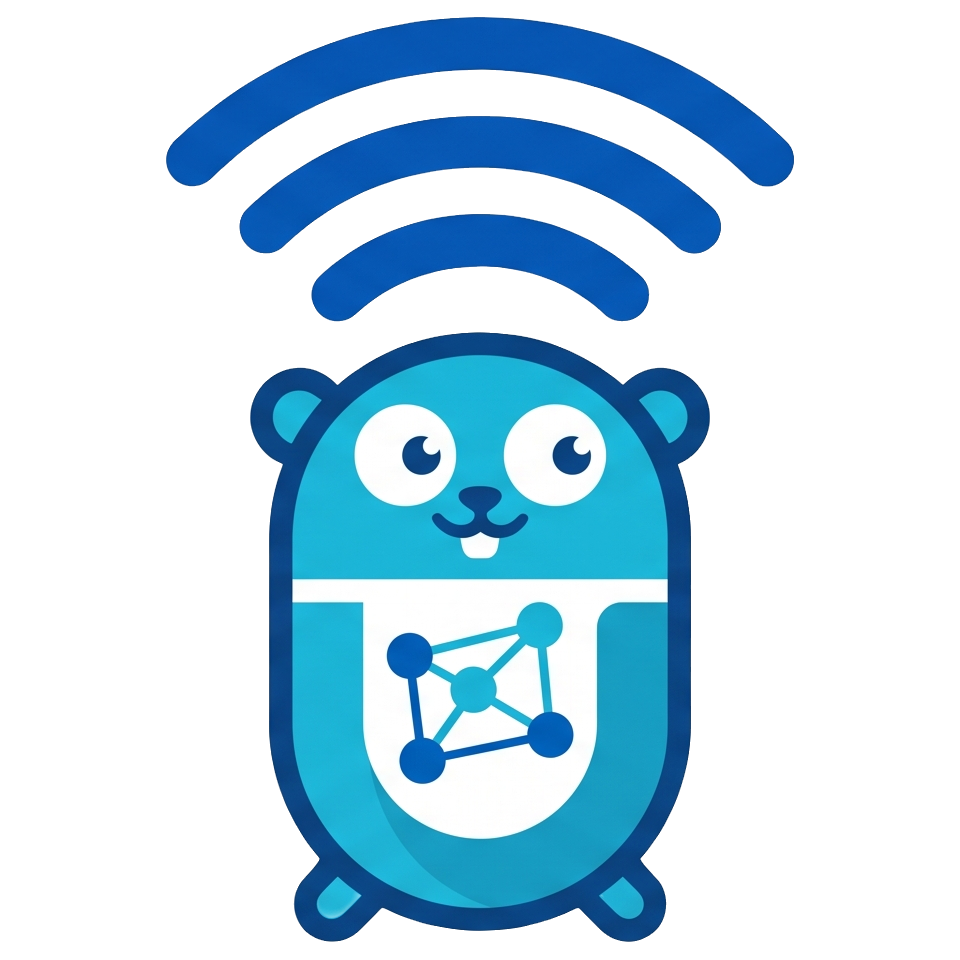

<div align="center">



# UniFi Go SDK


%3F&logo=ubiquiti&label=Supported%20Internal%20API%20Version&color=yellow)
%3F&logo=ubiquiti&label=Supported%20Official%20API%20Version&color=blue)
[](https://filipowm.github.io/go-unifi/)
[](https://pkg.go.dev/github.com/filipowm/go-unifi/v2/unifi)


</div>

A Go client for the UniFi Network Controller API. Most resource types are **code-generated** from the
controller's own API definitions and updated daily, with a hand-written client layer wrapping them in a
usable, strongly-typed SDK. It powers the [Terraform provider for UniFi](https://github.com/filipowm/terraform-provider-unifi),
but works standalone in any Go project.

> 📖 **Full documentation lives at [filipowm.github.io/go-unifi](https://filipowm.github.io/go-unifi/).**
> This README is just a quick start — installation, configuration, the guides, the API reference, and the
> migration guides all live on the docs site.

## Install

```bash
go get github.com/filipowm/go-unifi/v2
```

Requires Go 1.26+ and a new-style UniFi OS controller (version **9.0.114** or newer) with **API-key**
authentication. See [Authentication](https://filipowm.github.io/go-unifi/docs/getting-started/authentication)
for how to create an API key.

## Quick start

```go
c, err := unifi.NewClient(&unifi.ClientConfig{
    URL:    "https://unifi.localdomain",
    APIKey: "your-api-key",
})
if err != nil {
    log.Fatal(err)
}

networks, err := c.ListNetwork(ctx, "default")
```

That uses the Internal API (the canonical default). The client also exposes the official UniFi OpenAPI via
`c.Official()` — see [Choosing a surface](https://filipowm.github.io/go-unifi/docs/guides/choosing-a-surface)
for when to use which.

## Documentation

- **[Getting started](https://filipowm.github.io/go-unifi/docs/getting-started)** — installation, authentication, connecting, quickstart
- **[Guides](https://filipowm.github.io/go-unifi/docs/guides)** — networks, clients & users, devices, firewall, wireless, sites, pagination, error handling, testing
- **[Advanced](https://filipowm.github.io/go-unifi/docs/advanced)** — configuration, validation, interceptors, raw HTTP, concurrency, logging, troubleshooting
- **[Reference](https://filipowm.github.io/go-unifi/docs/reference)** — client, configuration types, errors, API coverage
- **[Compatibility matrix](https://filipowm.github.io/go-unifi/docs/advanced/compatibility)** — `go-unifi` releases ↔ supported UniFi Controller versions
- **[Developers](https://filipowm.github.io/go-unifi/docs/developers)** — code generation, regenerating, contributing, release process

## Migrating

- **From `go-unifi` 1.x** → the [1.x → 2.0 migration guide](https://filipowm.github.io/go-unifi/docs/migrating/from-1.x) and the [breaking-changes log](https://filipowm.github.io/go-unifi/docs/migrating/breaking-changes)
- **From `paultyng/go-unifi`** → the [migration guide](https://filipowm.github.io/go-unifi/docs/migrating/from-paultyng) (this SDK is a fork; core methods are the same)

## Contributing

Contributions are welcome! Please feel free to submit a Pull Request. For major changes, please open an
issue first to discuss what you would like to change — I will be happy to find additional maintainers! See
the [developer docs](https://filipowm.github.io/go-unifi/docs/developers/contributing) to get set up.

## Acknowledgment

This project is a fork of [paultyng/go-unifi](https://github.com/paultyng/go-unifi). Huge thanks to Paul Tyng
and the rest of the maintainers for creating and maintaining the original SDK, which provided an excellent
foundation for this fork. The fork was created to keep the SDK current with the latest UniFi Controller
versions and to add more dev-friendly client usage, enhanced error handling, additional API endpoints,
improved documentation, better test coverage, and various bug fixes.

## License

Licensed under the [Mozilla Public License 2.0](LICENSE).
